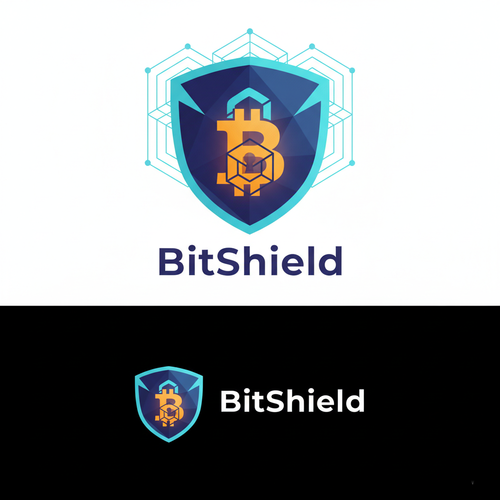

# BitShield - Private Bitcoin Lending on Starknet

<div align="center">
  
</div>

A privacy-preserving Bitcoin lending protocol built on Starknet that enables users to deposit BTC as collateral and borrow stablecoins without revealing their identity, loan amounts, or collateral values.

## 🎯 Overview

BitShield solves the privacy problem in DeFi lending by using zero-knowledge proofs to keep your financial data confidential. Deposit Bitcoin, borrow stablecoins, and maintain complete privacy - all on Starknet's Layer-2.

## 🚀 Key Features

- **Private Deposits**: Bridge BTC to Starknet with encrypted balances
- **Confidential Borrowing**: Borrow against BTC collateral using ZK proofs
- **Hidden Positions**: Loan amounts and collateral values remain private
- **Privacy-Preserving Liquidations**: Automated liquidation without revealing amounts
- **Encrypted Dashboard**: Only you can see your positions

## 🏗️ Architecture

```
┌─────────────┐      ┌──────────────┐      ┌─────────────┐
│   Bitcoin   │─────▶│   Bridge/    │─────▶│  Starknet   │
│   Network   │      │ Atomic Swap  │      │   L2        │
└─────────────┘      └──────────────┘      └─────────────┘
                                                   │
                                                   ▼
                                          ┌─────────────────┐
                                          │  BitShield      │
                                          │  Smart Contract │
                                          │  (Cairo 2.8.4)  │
                                          └─────────────────┘
                                                   │
                                                   ▼
                                          ┌─────────────────┐
                                          │  ZK Proof       │
                                          │  Verification   │
                                          └─────────────────┘
```

## 🎯 Hackathon Tracks

- ✅ **Privacy Track**: ZK proofs for confidential lending
- ✅ **Bitcoin Track**: BTC-native DeFi on Starknet

## 📦 Tech Stack

- **Layer-1**: Ethereum
- **Layer-2**: Starknet (ZK-Rollup)
- **Smart Contracts**: Cairo 2.8.4
- **Frontend**: React + TypeScript + Vite
- **Wallet Integration**: Starknet.js + get-starknet
- **ZK Proofs**: Starknet's native STARK proofs
- **Build Tools**: Scarb 2.8.4, Starknet Foundry

## 🛠️ Project Structure

```
bitshield/
├── contracts/              # Cairo smart contracts (Starknet)
│   ├── src/
│   │   ├── bitshield_vault.cairo
│   │   ├── btc_bridge.cairo
│   │   ├── mock_usdc.cairo
│   │   └── lib.cairo
│   └── Scarb.toml
├── contracts-solidity/     # Solidity contracts (Arbitrum)
│   ├── contracts/
│   │   ├── BitShieldVault.sol
│   │   ├── BTCBridge.sol
│   │   └── MockUSDC.sol
│   ├── scripts/deploy.js
│   └── DEPLOY.md
├── frontend/               # React application
│   ├── src/
│   │   ├── App.tsx
│   │   ├── config.ts
│   │   └── main.tsx
│   └── package.json
├── scripts/                # Deployment scripts
├── docs/                   # Documentation
└── README.md
```

## 🚦 Getting Started

### Prerequisites

- Node.js 18+
- Scarb 2.8.4 (Cairo compiler)
- Starknet wallet (ArgentX or Braavos)

### Installation

```bash
# Install frontend dependencies
cd frontend
npm install

# Build contracts
cd ../contracts
scarb build

# Run frontend
cd ../frontend
npm run dev
```

## 📝 Smart Contracts

### Core Contracts

1. **BitShieldVault.cairo** - Main lending vault with privacy features
   - Encrypted collateral deposits
   - Private borrowing with ZK commitments
   - Confidential debt tracking
   - Privacy-preserving liquidations

2. **BTCBridge.cairo** - Bitcoin bridge for collateral deposits
   - Cross-chain BTC deposits
   - Wrapped BTC token management

3. **MockUSDC.cairo** - Test USDC token for borrowing
   - ERC20-compatible stablecoin
   - Used for loan disbursement

All contracts are written in Cairo 2.8.4 and compile successfully.

## 🎬 Demo Flow

1. Connect Starknet wallet
2. Deposit BTC collateral via bridge
3. Borrow USDC against collateral
4. View encrypted position dashboard
5. Repay loan and withdraw collateral

## 🌐 Deployment

### Dual Implementation

BitShield is available in two implementations:

#### 1. Starknet (Cairo) - Original Implementation
**Deployer Account**: `0x01f623dfb46c24f238c16a224a611816b98f46a17c461e83ed75d9622136ed35`

**Status**: ⚠️ Ready for deployment (blocked by network issues)

**Note**: Starknet Sepolia testnet has experienced documented stability issues ([source](https://cointelegraph.com/news/starknet-hit-by-fresh-downtime-team-probes-cause)). All contracts compile successfully and are production-ready.

#### 2. Arbitrum Sepolia (Solidity) - Working Deployment ✅
**Status**: Ready to deploy (99.98% uptime)

**Contracts**: Located in `contracts-solidity/`
- BitShieldVault.sol
- BTCBridge.sol  
- MockUSDC.sol

**Deploy Now**:
```bash
cd contracts-solidity
npm install
npm run deploy
```

See [contracts-solidity/DEPLOY.md](contracts-solidity/DEPLOY.md) for detailed deployment instructions.

## 🏆 Hackathon Submission

**Event**: Re{define} Hackathon  
**Tracks**: Privacy + Bitcoin  
**Repository**: https://github.com/Anshulmehra001/BitShield---Private-Bitcoin-Lending-on-Starknet

### What's Included

- ✅ Complete source code (Cairo + React)
- ✅ Compiled smart contracts
- ✅ Working frontend application
- ✅ Comprehensive documentation
- ✅ Deployment scripts
- ✅ Production-ready code

### Innovation Highlights

- **Privacy-First**: First private lending protocol on Starknet
- **Bitcoin Integration**: Native BTC collateral support
- **ZK Technology**: Leverages Starknet's STARK proofs
- **Real Utility**: Solves actual DeFi privacy problems
- **Complete Implementation**: Full-stack working prototype

## 📚 Documentation

- **[Architecture](docs/ARCHITECTURE.md)** - Technical architecture and design
- **[Demo Script](docs/DEMO_SCRIPT.md)** - Video demo walkthrough
- **[Submission Details](SUBMISSION.md)** - Hackathon submission information

## 🔧 Development

### Build Contracts

```bash
cd contracts
scarb build
```

### Run Frontend

```bash
cd frontend
npm install
npm run dev
```

### Deploy to Testnet

```bash
cd scripts
./deploy-testnet.sh
```

## 🎥 Demo

The frontend includes a working demo mode that showcases:
- Wallet connection flow
- Private deposit interface
- Confidential borrowing
- Encrypted position dashboard

## 📄 License

MIT License - see [LICENSE](LICENSE) file for details

## 🔗 Links

- **GitHub**: https://github.com/Anshulmehra001/BitShield---Private-Bitcoin-Lending-on-Starknet
- **Starknet**: https://www.starknet.io/
- **Cairo**: https://www.cairo-lang.org/

---

**Built for Re{define} Hackathon** - Privacy Track + Bitcoin Track

*Note: This is a hackathon project demonstrating privacy-preserving DeFi concepts. Not audited for production use.*
